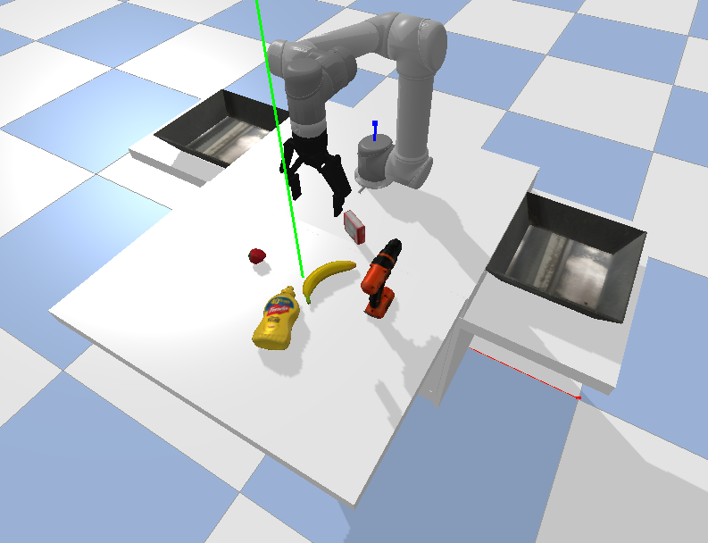

# Lifelong Object Recognition and Grasp Synthesis using Dual Memory Recurrent Self-Organization Networks

## Robot Grasping 

Simulated robot environment code availabe in this repository is the modified version of [Learning to Grasp Objects in Highly Cluttered Environments using Deep Convolutional Neural Networks](https://github.com/JeroenOudeVrielink/ur5-robotic-grasping)

Modified version of simulation robot environment. 

Thesis work, Universiry of Groningen
