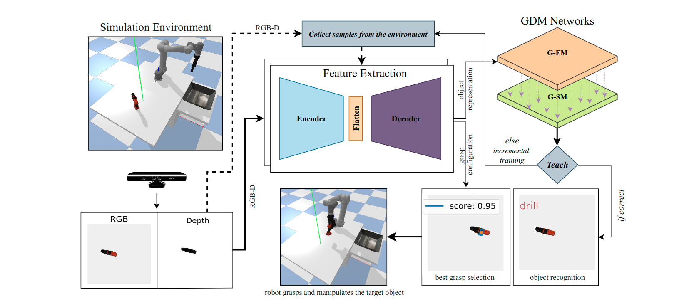
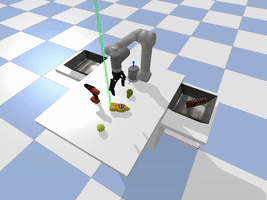
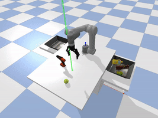
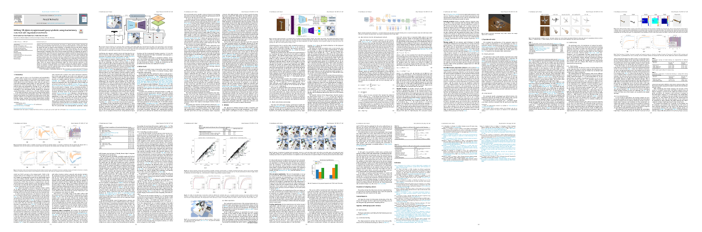

## Lifelong Object Recognition and Grasp Synthesis using Dual Memory Recurrent Self-Organization Networks

<p align="center">
  
</p>

This repository contains the implementation of synthetic sequential point cloud dataset generation and the implementation of hybrid learning architecture, comparises of generative autoencoder and the growing dual memory networks (GDM) for contiual learning of object recognition and grasping synthesis towards lifelong learning fashion.

 * ``` dataset_generation ``` folder contains the implementation of sequential point cloud dataset generation in _ROS melodic_. 
 * ``` CNN ``` folder contains the implementation and evaluation of the proposed autoencoder model. 
 * ``` GDM_learning ``` as the name implies, conatins the implementation and evaluation of the updated and modified version of growing dual-memory networks in bacth and incremental learning scenarios. 
 * ``` Grasping and dual_pipeline.py ``` contains the end-end implementation of the proposed system architecture in _pybullet_ simulation environment for pick and place, and pack manipulation tasks.

## Requirements and Installation
* python 3.8
* Install the required libraries by running, 
```
pip install -r requirements.txt
```
The ```requirements.txt``` file contains the esssential libraries for both dataset generation and continual learning. 

## Instructions
### Dataset Generation
Please follow the instruction given in the ```Readme.md``` in the ```dataset_generation``` folder to generate the dataset.

### Autoencoder:
A model can be trained using ```model_training.py``` script in ```CNN``` folder. Based on user input ('train' or 'val').

### GDM learning:
The instructions to run the GDM model training and testing on the batch and incremental learning scenrios are given in ```experiments.txt``` file in ```GDM_learning``` folder. 

Example for batch learning: 

```
python gdm_learning.py --mode both --test_mode both --learning_type batch --wandb_mode offline --features_path <path to extracted feature vectors> --num_trials 5 --epochs 35 --dist_type manhattan --preprocess 0 --mini_batch 1 --bs_size 50 --context 1 --num_context 2 --output_folder <output folder path/name>
```
Example for incremental learning:

```
python gdm_learning.py --mode both --test_mode both --learning_type incremental --wandb_mode offline --features_path <path to extracted feature vectors> --num_trials 5 --epochs 3 --dist_type manhattan --preprocess 0 --mini_batch 1 --bs_size 50 --context 1 --num_context 2 --memory_replay 1 --output_folder <output folder path/name> --e_threshold 0.5 --s_threshold 0.7 --beta 0.4 --e_b 0.5 --e_n 0.005
```

Run ```python gdm_learning.py --help``` to see full list of options. 

Note: The above-mentioned experiments need to run inside their respective folders. 


## Robot Experiment:
In the robot simulation demo, the real-time continous object recognition and grasp synthesis can be tested using ```dual-pipeline``` script. Using the script the model can be trained to learn new objects instance and category in contiual lifelong learning manner. Run ```dual-pipeline.py --help``` to see the list of options.

Example (for pack scenario):
```
python dual_pipeline.py --e_network_path <path to episodic memory network> --s_network_path <path to semantic memory network> --model_path <path to trained autoencoder model> --scenario pack
```
## Simulation Demo:
<p align="center"/>
  
  
  

Our simulation robot experiment results, (left) pick and place (pack) mustard bottle to basekt 2 and (right) pack power drill object to basket 1.

## Paper
Latest version available on [Neural Networks](https://doi.org/10.1016/j.neunet.2022.02.027)  (March 2022)



Please adequately refer to the papers any time this code is being used. If you do publish a paper where this work helped your research, we encourage you to cite the following paper in your publications:

```text
@article{SANTHAKUMAR2022167,
title = {Lifelong 3D object recognition and grasp synthesis using dual memory recurrent self-organization networks},
journal = {Neural Networks},
volume = {150},
pages = {167-180},
year = {2022},
issn = {0893-6080},
doi = {https://doi.org/10.1016/j.neunet.2022.02.027},
url = {https://www.sciencedirect.com/science/article/pii/S0893608022000685},
author = {Krishnakumar Santhakumar and Hamidreza Kasaei},
}
```

## Authors: 
Krishnakumar Santhakumar and [Hamidreza Kasaei](https://www.ai.rug.nl/irl-lab/)  
Work done while at [RUG](https://www.rug.nl/).
